# Luồng xử lý Text-to-SQL — SQLBot

> Sơ đồ dưới đây mô tả toàn bộ vòng đời một câu hỏi từ lúc frontend gửi lên tới khi SSE
> stream trả về chart. Các ô màu xanh là lần gọi LLM thật sự. Tham chiếu chi tiết từng pha
> xem trong [TEXT2SQL_CONCEPT.md](TEXT2SQL_CONCEPT.md).

---

## Sơ đồ tổng quan

```mermaid
flowchart TD
    START([Người dùng nhập câu hỏi])
    START --> API["POST /chat/question"]
    API --> INIT["LLMService.create — khởi tạo async"]
    INIT --> THREAD["ThreadPoolExecutor — run_task chạy trong thread"]

    THREAD --> DS_CHECK{DS đã được\nchọn sẵn?}
    DS_CHECK -->|Chưa| PH1
    DS_CHECK -->|Rồi| PH0

    subgraph PH1["Pha 1 — Chọn Datasource"]
        direction TB
        MULTI{Có nhiều DS\ntrong workspace?}
        MULTI -->|Chỉ 1 DS| AUTO["Tự động chọn\n— bỏ qua LLM"]
        MULTI -->|Nhiều DS| DSE["Embedding DS\ncosine → lọc Top-K ứng viên"]
        DSE --> LLM0[/"LLM #0\nNhận danh sách DS\n→ trả về ID hoặc fail"/]
        AUTO --> DS_FIXED[DS được cố định]
        LLM0 --> DS_FIXED
    end

    PH1 --> PH0

    subgraph PH0["Pha 0 — RAG Chuẩn bị Ngữ cảnh (song song, không gọi LLM)"]
        direction LR
        T["Thuật ngữ nghiệp vụ\nILIKE + pgvector similarity"]
        TR["Ví dụ SQL mẫu\nILIKE + pgvector similarity"]
        CP["Custom prompts\n(xpack)"]
        TE["Table Embedding\ncosine → chọn Top-K bảng\n+ kéo thêm bảng FK liên quan"]
        MS["Build M-Schema\n+ 3 dòng sample data mỗi bảng\n+ khối Foreign keys"]
        PROMPT_BUILD["Lắp Multi-turn Prompt\nSystem → Rules ack → Schema ack\n→ Terminology ack → Examples ack\n→ Lịch sử N lượt → Câu hỏi"]
        T --> MS
        TR --> MS
        CP --> MS
        TE --> MS
        MS --> PROMPT_BUILD
    end

    PH0 --> CONN["Pha 2 — Kiểm tra kết nối DB"]
    CONN -->|Lỗi| ERR_CONN(["SQLBotDBConnectionError"])
    CONN -->|OK| PH3

    subgraph PH3["Pha 3 — Sinh SQL"]
        direction TB
        LLM1[/"LLM #1 — streaming\nNhận prompt đã lắp ráp\n→ JSON: success · sql · tables · chart-type · brief"/]
    end

    PH3 --> PH4

    subgraph PH4["Pha 4 — Kiểm tra bảo mật (không tin SQL của LLM)"]
        direction TB
        GLOT["sqlglot parse SQL thật\n→ danh sách bảng thực sự dùng"]
        WL["Đối chiếu với whitelist\n= bảng nằm trong M-Schema đã đưa cho LLM"]
        GLOT --> WL
        WL -->|Bảng ngoài phạm vi| BLOCKED(["Chặn — ném lỗi"])
        WL -->|Hợp lệ| SAFE["Pass"]
    end

    SAFE --> FS1{finish_step?}
    FS1 -->|GENERATE_SQL| R_SQL(["Trả về SQL\nKhông thực thi"])
    FS1 -->|tiếp tục| PH5

    subgraph PH5["Pha 5 — Hậu xử lý SQL (hai nhánh loại trừ nhau)"]
        direction TB
        CTX{Ngữ cảnh?}
        CTX -->|"User thường\n+ có rule row-permission"| LLM2A[/"LLM #2a — permissions\nChèn mệnh đề WHERE\ntheo quyền hàng của user"/]
        CTX -->|"Assistant dynamic\n— bảng ảo → subquery"| LLM2B[/"LLM #2b — dynamic_sql\nThay placeholder bảng ảo\nbằng subquery thật"/]
        CTX -->|"Admin hoặc không có rule"| NOOP["Giữ nguyên SQL"]
    end

    LLM2A & LLM2B & NOOP --> PH6

    subgraph PH6["Pha 6 — Thực thi SQL"]
        direction TB
        EXEC["Kết nối DB thật\nChạy SQL\nChuẩn hóa số lớn · giới hạn 1 000 dòng"]
    end

    PH6 --> FS2{finish_step?}
    FS2 -->|QUERY_DATA| R_DATA(["Trả về bảng dữ liệu\nKhông sinh chart"])
    FS2 -->|GENERATE_CHART| PH7

    subgraph PH7["Pha 7 — Sinh cấu hình biểu đồ"]
        direction TB
        MS2["Build M-Schema rút gọn\nChỉ các bảng SQL thực sự dùng\n— lấy nhãn hiển thị từ custom_comment"]
        LLM3[/"LLM #3 — chart\nNhận sql · schema · chart-type gợi ý\n→ DSL JSON: type · axis · series"/]
        CHART_OK["check_save_chart\nnormalize · lưu DB · đẩy type:chart qua SSE"]
        MS2 --> LLM3 --> CHART_OK
    end

    CHART_OK --> FINISH(["SSE stream hoàn tất\nFrontend render AntV G2 / S2\nHoặc PNG qua image microservice cho MCP"])

    %% Màu sắc
    style LLM0  fill:#4dabf7,color:#000,stroke:#339af0
    style LLM1  fill:#4dabf7,color:#000,stroke:#339af0
    style LLM2A fill:#4dabf7,color:#000,stroke:#339af0
    style LLM2B fill:#4dabf7,color:#000,stroke:#339af0
    style LLM3  fill:#4dabf7,color:#000,stroke:#339af0

    style BLOCKED   fill:#fa5252,color:#fff,stroke:#e03131
    style ERR_CONN  fill:#fa5252,color:#fff,stroke:#e03131

    style R_SQL   fill:#2f9e44,color:#fff,stroke:#2f9e44
    style R_DATA  fill:#2f9e44,color:#fff,stroke:#2f9e44
    style FINISH  fill:#2f9e44,color:#fff,stroke:#2f9e44

    style START   fill:#f8f9fa,stroke:#868e96
```

---

## Số lần gọi LLM theo tình huống

| Tình huống | LLM calls |
|---|:---:|
| DS cố định · không có row-permission · full chart | **2** |
| Chưa chọn DS (workspace nhiều DS) | **+1** |
| User thường có rule row-permission | **+1** |
| Assistant dynamic datasource (type 1 hoặc 3) | **+1** (thay cho +1 ở trên) |
| `finish_step = QUERY_DATA` (không cần chart) | trừ 1 |
| Lệnh `/analysis` hoặc `/predict` | 1 riêng biệt |
| Embedding model (chọn bảng / DS / thuật ngữ / ví dụ) | không tính vào LLM |

---

## Tóm tắt vai trò từng lần gọi LLM

| Lần gọi | Prompt key | Nhiệm vụ | Output |
|---|---|---|---|
| **#0** | `datasource` | Chọn DS phù hợp với câu hỏi | `{id}` hoặc `{fail}` |
| **#1** | `sql` | Sinh SQL + gợi ý chart type + đặt tiêu đề | `{success, sql, tables, chart-type, brief}` |
| **#2a** | `permissions` | Chèn điều kiện WHERE theo quyền hàng | `{success, sql}` |
| **#2b** | `dynamic_sql` | Thay bảng ảo bằng subquery thật | `{success, sql}` |
| **#3** | `chart` | Quyết định loại biểu đồ + ánh xạ trục / chỉ số | DSL JSON chart config |
