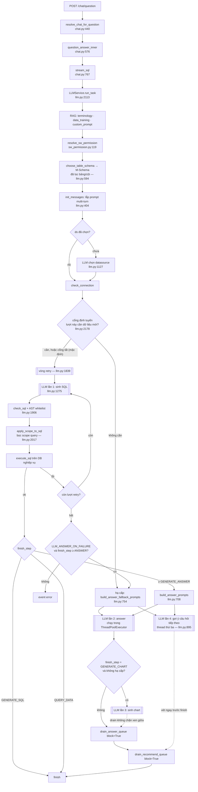

# Pipeline Text2SQL

> Mô tả pipeline **của repo này** (fork HĐND), không phải của SQLBot upstream. Tài liệu trỏ tới code
> bằng `file:line` thay vì chép code — số dòng có thể lệch sau khi sửa, nội dung thì không.
>
> Chưa đọc [AI_ONBOARDING.md](AI_ONBOARDING.md) thì đọc trước, nhất là §2 (fork khác upstream ở đâu).

---

## 1. Triết lý thiết kế

Bốn nguyên tắc chi phối toàn bộ pipeline. Hiểu chúng thì đoán đúng chỗ đặt code cho một tính năng
mới; không hiểu thì sẽ liên tục viết ra thứ bị ba tầng bảo mật chặn.

**LLM không bao giờ chạm database.** Nó chỉ nhận schema dạng text (M-Schema) và trả về chuỗi SQL.
Toàn bộ việc kết nối, thực thi, phân trang do backend làm. Không có tool-calling, không có agent
loop kết nối DB.

**Không tin SQL do LLM sinh ra.** SQL bị parse bằng `sqlglot` và đối chiếu với whitelist bảng
trước khi chạy — xem §9. Prompt rule chỉ là tầng phòng thủ mềm nhất.

**RAG dùng để thu hẹp context, không phải để trả lời.** Embedding chọn ra top-K bảng / thuật ngữ /
ví dụ SQL liên quan nhất rồi nhét vào prompt. Câu trả lời cuối cùng luôn dựa trên dữ liệu **thật**
lấy từ DB, không dựa trên tài liệu truy hồi.

**Ép output JSON ở mọi pha có máy đọc.** SQL, chart config, predict, guess đều yêu cầu LLM trả JSON
để backend parse được xác định. Chỉ pha `answer` là văn xuôi tự do, vì đích đến là mắt người.

---

## 2. Sơ đồ luồng



**Ô `RG` — cổng định tuyến — mặc định TẮT**, và khi tắt thì sơ đồ chạy đúng như trước khi có nó:
không thêm lời gọi LLM, không thêm event SSE, không thêm bản ghi `chat_log`. Bật bằng
`LLM_ROUTE_ENABLED`. Xem §5.

**Nhánh chart mặc định CÓ chạy.** `POST /chat/question` lấy điểm dừng từ `GENERATE_CHART_ENABLED`
(mặc định `True` → `GENERATE_CHART`), qua hàm `default_finish_step`
([chat.py:465](../backend/apps/chat/api/chat.py#L465)). Đặt biến đó về `False` thì luồng dừng ở ô
`W`. Nhánh MCP không đi qua đây, nó tự truyền `QUERY_DATA`.

Hai chỗ chart **không** chạy bất kể cấu hình: lượt hạ cấp (không có dữ liệu thì biểu đồ vô nghĩa),
và khi pha SQL hỏng hẳn.

**Ô `Y` — gợi ý câu hỏi tiếp theo — cũng là phần fork thêm vào.** Nó khởi động cùng chỗ với answer,
tức là **sau** vòng retry: lượt hỏng cứng (mất kết nối DB, `domainCode` ngoài quyền, phễu bảng rỗng)
thoát ra trước điểm đó nên không tốn thêm lời gọi LLM nào, còn lượt **hạ cấp thì vẫn có gợi ý** —
người dùng vừa hỏi hụt là lúc gợi ý có ích nhất. Tắt bằng `CHAT_INLINE_RECOMMEND_ENABLED`. Xem §6.

**Hai ô `F2` và `M2` chỉ hoạt động với người dùng có quyền đồng bộ từ hệ SW.** Người dùng không có
dòng quyền nào đi qua chúng như không có gì xảy ra — xem §13.

---

## 3. Đường đi của một request

| Bước | Vị trí | Việc |
|---|---|---|
| Route | [chat.py:485](../backend/apps/chat/api/chat.py#L485) | `POST /chat/question` |
| Giải nghĩa chat | [chat.py:440](../backend/apps/chat/api/chat.py#L440) `resolve_chat_for_question` | Chuyển `chat_id` (int nội bộ **hoặc** `external_id` dạng UUID) thành id nội bộ. **Bắt buộc là FastAPI dependency**, không được gọi trong thân hàm, vì `require_permissions` cần thấy id nội bộ đã giải nghĩa |
| Điều phối | [chat.py:576](../backend/apps/chat/api/chat.py#L576) `question_answer_inner` | Tách quick-command (`/regenerate`, `/analysis`, `/predict`) khỏi câu hỏi thường |
| Dựng stream | [chat.py:767](../backend/apps/chat/api/chat.py#L767) `stream_sql` | Tạo `LLMService`, trả `StreamingResponse`. Docstring ở đây giải thích từng tham số, kể cả "núm vặn" `finish_step` |
| Chạy pipeline | [llm.py:2113](../backend/apps/chat/task/llm.py#L2113) `run_task` | Toàn bộ pipeline, dạng generator yield từng dòng SSE |

`run_task` chạy trong thread riêng (`run_task_async`, [llm.py:1770](../backend/apps/chat/task/llm.py#L1770)),
kết quả đẩy qua queue để route async đọc ra. Đó là lý do trong `run_task` phải tự mở session
(`session_maker()`) chứ không dùng `SessionDep` của FastAPI.

---

## 4. `ChatFinishStep` — núm vặn điểm dừng

```
GENERATE_SQL(1)  <  QUERY_DATA(2)  <  GENERATE_ANSWER(3)  <  GENERATE_CHART(4)
```

Định nghĩa: [chat_model.py:57](../backend/apps/chat/models/chat_model.py#L57).

**Giá trị số chính là thứ tự pha.** Mọi chốt trong `run_task` so sánh `finish_step.value <= X`, nên
chèn một pha mới **bắt buộc phải đánh số lại** cho đúng thứ tự chạy. Giá trị chỉ tồn tại trong
runtime — không lưu DB, không nhận từ request — nên đánh số lại là an toàn, miễn sửa hết các chỗ
truyền tường minh.

`GENERATE_ANSWER` nằm **giữa** `QUERY_DATA` và `GENERATE_CHART` vì answer chạy ngay khi có dữ liệu,
không chờ chart xong.

| Ai gọi | Giá trị | Vì sao |
|---|---|---|
| `POST /chat/question` (web + đối tác) | `GENERATE_CHART` khi `GENERATE_CHART_ENABLED=True` (mặc định), ngược lại `GENERATE_ANSWER` — `default_finish_step` ([chat.py:465](../backend/apps/chat/api/chat.py#L465)) | Client cần câu trả lời chữ; biểu đồ là phần thêm, bật/tắt được mà không sửa code |
| MCP | `QUERY_DATA` ([mcp.py:258](../backend/apps/mcp/mcp.py#L258)) | MCP tự trả markdown/JSON tổng hợp, không tiêu thụ answer |

`default_finish_step` đọc setting **trong thân hàm**, không đặt làm giá trị mặc định của tham số:
giá trị mặc định bị Python chốt lại một lần lúc import module, nên test monkeypatch `settings` sẽ
không có tác dụng.

Các chốt trong `run_task`: dừng sau SQL ([llm.py:1994](../backend/apps/chat/task/llm.py#L1994)),
dừng sau dữ liệu ([llm.py:2215](../backend/apps/chat/task/llm.py#L2215)), dừng sau answer
([llm.py:2277](../backend/apps/chat/task/llm.py#L2277)).

---

## 5. Cổng định tuyến, vòng retry và nhánh hạ cấp

Cả ba đều là phần fork thêm vào, upstream không có. Cổng định tuyến nằm riêng ở
[question_gate.py](../backend/apps/chat/task/question_gate.py); vòng retry và nhánh hạ cấp nằm trong
[llm.py:1781-2112](../backend/apps/chat/task/llm.py#L1781) `_sql_phase`.

### 5.1. Cổng định tuyến câu hỏi

Một lượt gọi LLM **ngắn** đặt trước pha SQL, trả lời đúng một câu: lượt này có cần truy vấn dữ liệu
mới không. Mặc định **tắt** (`LLM_ROUTE_ENABLED=False`).

Vấn đề nó giải: pha SQL chạy cho **mọi** câu hỏi, kể cả câu chào hỏi, câu tham chiếu ngược vào kết
quả lượt trước, hay câu hỏi về chính datasource. Đó là pha đắt nhất và cũng là pha bơm cả m-schema
vào ngữ cảnh, nên chạy thừa vừa tốn tiền vừa làm nhiễu câu trả lời — và những event SSE đã trót phát
ra thì không prompt nào ở pha sau gỡ lại được.

**Vị trí**: ngay sau `check_connection`, trước `_sql_phase` ([llm.py:2178](../backend/apps/chat/task/llm.py#L2178)).
Phải đứng sau `init_messages` vì cổng cần `table_name_list` — và đó cũng là lý do nó không thể lùi
sớm hơn.

**Năm nhóm phân loại**, tập đóng để tổng hợp được bằng SQL trên bảng log:

| `category` | `action` | Ví dụ |
|---|---|---|
| `need_data` | `sql` | "tổng thu ngân sách 2024 là bao nhiêu" |
| `backref` | `answer` | "trong đó cái nào lớn nhất" — dữ liệu đã có ở lượt trước |
| `meta` | `answer` | "datasource này có những bảng nào" |
| `chitchat` | `answer` | "xin chào" |
| `general` | `answer` | câu hỏi kiến thức chung, không liên quan dữ liệu |

**Ba ràng buộc thiết kế**, ghi trong docstring của module và không được phá:

- **Hỏng-mở.** Mọi đường hỏng — LLM lỗi, JSON không đọc được, `action` mâu thuẫn với `category` —
  đều rơi về `sql`, tức đúng hành vi khi chưa có cổng. Cổng không bao giờ ném exception ra ngoài.
  Bất đối xứng của hai loại sai chính là lý do: chọn nhầm `sql` chỉ tốn vài giây, chọn nhầm `answer`
  là người dùng mất số liệu họ cần.
- **Không phải generator.** Cổng trả về giá trị thường, chỗ gọi chỉ là một phép gán. Đi qua
  `yield from` là kéo theo cả lớp bẫy hai-kênh mà `_sql_phase` phải cảnh báo bằng cờ `stopped`.
- **Log riêng.** Cổng tự đóng bản ghi `chat_log` của mình (`OperationEnum.ROUTE_QUESTION = '15'`)
  trước khi trả về, không gửi gắm cho khối `except` của `run_task` qua `current_logs`.

**Prompt cổng cố ý nghèo**: chỉ **tên bảng** và vài lượt lịch sử gần nhất (`LLM_ROUTE_HISTORY_*`),
không có m-schema, không có thuật ngữ, không có custom_prompt. Cổng mà đọc m-schema thì nó đã tiêu
đúng cái ngân sách ngữ cảnh mà nó sinh ra để tiết kiệm. Khối prompt: `route` trong `template.yaml`
(§10). Model riêng đặt bằng `LLM_ROUTE_MODEL_ID`, mặc định dùng chung model chính.

**Chế độ chỉ đo (`LLM_ROUTE_SHADOW`, mặc định bật).** Cổng vẫn chạy và vẫn ghi log đầy đủ, nhưng
quyết định `answer` bị ép về `sql` kèm dấu `forced='shadow'`. Hành vi người dùng nhìn thấy không đổi,
trong khi log tích được phân bố **thật trên lưu lượng thật** — bộ eval offline quá nhỏ để tin vào tỷ
lệ nó cho ra. Dấu `forced` phân biệt "cổng chọn sql" với "cổng bị ép về sql", gộp lại thì số đo mất
sạch ý nghĩa. Đọc số bằng `scripts/route_stats/report.py`; ngưỡng phải xem trước cả tỷ lệ tiết kiệm
là nhóm `unparsed` / `mismatch` / `error` — nhóm đó cao nghĩa là cổng đang hỏng chứ không phải đang
thận trọng.

**Nhánh MCP không bao giờ bị định tuyến**, bất kể cấu hình: điều kiện bật cổng là `in_chat` và
`finish_step.value > QUERY_DATA`. Toàn bộ pha answer nằm trong nhánh `if in_chat`, nên rẽ sang
`answer` ở nhánh MCP sẽ trả về kết quả **rỗng không kèm lỗi**.

**Lượt bị rẽ đi lại đúng nhánh hạ cấp sẵn có**, không có nhánh thứ hai song song — khác biệt gói gọn
trong `fallback_kind` (mục 5.4). Hệ quả với client: lượt đó không có `sql` / `sql-data` / `sql-result`
nhưng vẫn có `answer-result` → `answer` → `finish`, và **không có biểu đồ** dù đang bật.

### 5.2. Cấu trúc

Toàn bộ pha SQL (sinh → kiểm tra → chạy) nằm trong một `while True`. Bốn loại exception bị bắt:
`SingleMessageError`, `SQLBotDBError`, `ParseSQLResultError`, `SQLBotDBConnectionError`
([llm.py:2067](../backend/apps/chat/task/llm.py#L2067)).

```
lỗi → còn lượt retry?  ─ có ─→  sinh lại SQL, kèm lý do hỏng
                       └ không ─→ đủ điều kiện hạ cấp? ─ có ─→ answer dựa trên lịch sử
                                                        └ không ─→ raise → event error
```

### 5.3. Bốn quyết định thiết kế cần biết trước khi sửa

**Mất kết nối DB thì không retry.** `SQLBotDBConnectionError` bỏ qua thẳng sang nhánh hạ cấp —
sinh lại SQL không cứu được gì.

**Lần retry không phát event SSE nào mới.** Hợp đồng stream giữ nguyên như trước, client không phải
biết tới khái niệm retry. Dấu vết chỉ nằm ở log. Hệ quả với client: có thể thấy **nhiều hơn một**
event `info: sql generated` trong một lượt — xem [API_SPEC.md §6.8](api_spec/API_SPEC.md#68-lượt-hỏi-không-có-sql-và-sql-data).

**Nhánh hạ cấp cố ý KHÔNG gọi `save_error`.** Web UI hiện khối lỗi đỏ với mọi record có
`chat_record.error` khác rỗng, mà lượt này sắp có câu trả lời tử tế. Lý do hỏng vẫn nằm đủ trong log.

**Prompt retry chỉ thêm một message ngắn nêu lý do**, không dựng lại prompt đầy đủ
([llm.py:1275](../backend/apps/chat/task/llm.py#L1275) `generate_sql`). Câu hỏi gốc và m-schema vẫn
nằm trong `self.sql_message` phía trên. Quan trọng hơn: **câu trả lời hỏng và lời nhắc sửa chỉ nằm
trong danh sách `messages` tạm của lần gọi này, không nhập vào `self.sql_message`** — nếu không,
lượt sau sẽ đọc thấy lời khiển trách "câu trả lời vừa rồi KHÔNG dùng được" và hiểu là đang nói về
chính nó.

### 5.4. Điều kiện hạ cấp

Chỉ hạ cấp khi **cả ba** đúng: `in_chat` (không phải nhánh MCP), `LLM_ANSWER_ON_FAILURE=True`, và
`finish_step.value >= GENERATE_ANSWER`. Các nhánh dừng sớm vẫn cần nhận lỗi thật để giữ nguyên hợp
đồng cũ.

Prompt fallback ([llm.py:754](../backend/apps/chat/task/llm.py#L754)) thay `<data>` bằng tóm tắt các
lượt hỏi-đáp cũ, cộng thêm **danh sách tên bảng** (không phải cả m-schema): nhóm câu hỏi về chính
datasource ("có bao nhiêu bảng") gần như luôn làm pha SQL gãy, trong khi đáp án nằm sẵn trong schema.

System prompt fallback tách hẳn khỏi system prompt answer thường
([chat_model.py:460](../backend/apps/chat/models/chat_model.py#L460)): prompt chính bắt buộc "chỉ
dùng số trong `<data>`", mà nhánh này không có `<data>` nào.

**Hai biến thể giọng kể — `fallback_kind`.** Cùng một nhánh hạ cấp phục vụ hai tình huống khác hẳn
nhau về sự thật, nên prompt phải nói khác nhau:

| `fallback_kind` | Khi nào | Prompt nói gì |
|---|---|---|
| `failed` (mặc định) | pha SQL đã chạy và hỏng hẳn | được phép kể là lượt này không lấy được dữ liệu mới |
| `no_query` | cổng định tuyến quyết định không cần truy vấn (§5.1) | **cấm** nói hệ thống gặp lỗi hay không truy vấn được — lượt này hệ thống không hề thử truy vấn |

Cơ chế: khối `answer.fallback_variants` trong `template.yaml` giữ hai mảnh chữ (`situation` và
`insufficient_rule`), `answer_fallback_sys_question()` chọn mảnh theo `fallback_kind` rồi ghép vào
cùng một `fallback_system`. Phần luật chung chỉ có **một bản** — tách đôi cả prompt thì hai bản sẽ
trôi khỏi nhau. Có test khoá cả hai rủi ro đó ở `tests/test_answer_fallback_kind.py`: giọng kể sự cố
không được rò sang biến thể `no_query`, và bộ luật chung phải còn nguyên ở cả hai.

---

## 6. Pha answer và các pha chạy song song

### Song song hoá

Answer chạy trong worker của `ThreadPoolExecutor` ([llm.py:67](../backend/apps/chat/task/llm.py#L67),
`max_workers=200`), đẩy chunk qua `queue.Queue`. Luồng chính vét queue **không chặn** xen giữa các
chunk chart, và **chặn** ở cuối cùng trước khi phát `finish`.

Một lượt hỏi bình thường chạy **ba** worker trên cùng executor đó: answer, chart và gợi ý câu hỏi
tiếp theo. Cả ba theo chung một khuôn — worker tự mở session (`session_maker` là `scoped_session`,
thread-local nên không chia sẻ được), sentinel `'done'` đặt trong `finally` để luồng chính không chờ
vô hạn khi thread chết giữa chừng, và **hỏng thì phát `info` rồi đi tiếp** chứ không phát `error`,
không gọi `save_error`.

| Hàm | Dòng | Việc |
|---|---|---|
| `build_answer_prompts` | [663](../backend/apps/chat/task/llm.py#L708) | Render cặp (system, user) prompt **trong luồng chính** |
| `build_answer_fallback_prompts` | [709](../backend/apps/chat/task/llm.py#L754) | Bản cho nhánh hạ cấp |
| `generate_answer` | [736](../backend/apps/chat/task/llm.py#L789) | Gọi LLM, yield chunk |
| `run_answer_worker` | [787](../backend/apps/chat/task/llm.py#L840) | Chạy trong thread, bơm vào queue |
| `drain_answer_queue` | [807](../backend/apps/chat/task/llm.py#L860) | Vét queue thành event SSE |

**Prompt phải render trong luồng chính**, không được để thread tự dựng. Lý do: answer và chart cùng
đọc `self.chat_question`. `build_answer_prompts` dựng trên một `model_copy()` rồi chỉ đưa hai chuỗi
đã render sang thread — thread không còn chạm state dùng chung. Việc đọc lịch sử từ DB cũng phải
nằm ở đây vì cùng lý do: **`_session` không được đi qua thread**.

`generate_answer` cố ý **không gán lại `self.record`** sau khi lưu — luồng chart cũng đang gán, ghi
đè lẫn nhau sẽ hỏng.

### Cụm chống bịa số

Bốn thứ hoạt động như một khối, sửa một cái mà quên cái kia là tái sinh lỗi:

1. **`ANSWER_MAX_ROWS = 100`** ([llm.py:79](../backend/apps/chat/task/llm.py#L79)) — trần số dòng
   nhồi vào prompt answer. SQL đã bị chặn ở 1000 dòng, nhưng nhồi cả 1000 chỉ tốn token.
2. **`build_data_scope_note(total, sent)`** ([llm.py:82](../backend/apps/chat/task/llm.py#L82)) —
   câu văn nói cho LLM biết `<data>` là đủ hay đã cắt. Nêu tổng thật **kể cả khi không cắt**, để LLM
   khỏi phải tự đếm.
3. **Vị trí trong prompt**: `data_scope` đặt **sau** `<data>`, `answer_history` đặt **đầu** prompt.
   Đứng cuối thì trọng số cao nhất khi LLM quyết lấy con số tổng từ đâu; đặt lịch sử (chứa số liệu
   cũ) sau `<data-scope>` là cướp mất chính cái chốt đó. Xem
   [chat_model.py:447](../backend/apps/chat/models/chat_model.py#L447).
4. **Rule trong `answer.system`** ([template.yaml:630](../backend/templates/template.yaml#L630)) —
   cấm bịa, và quy tắc lấy tổng từ `<data-scope>`.

Hai ca lỗi đã đo được, ghi lại để không ai "tối ưu" mất:

- SQL trả **136** dòng, cắt còn 100, không báo → câu trả lời khẳng định "tổng cộng 72 nghị quyết".
- Liệt kê đúng đủ **15** tên nhưng câu mở đầu viết "gồm 16 cán bộ" (LLM tự đếm sai).

### Lịch sử trong nhánh answer thường

`LLM_ANSWER_HISTORY_ENABLED=True` đưa lịch sử hỏi-đáp vào cả nhánh answer bình thường, không chỉ
fallback. Đây là ngữ cảnh đầy đủ **nhưng cũng là rủi ro**: prompt answer cấm bịa số, giờ trong
prompt lại có sẵn những con số không thuộc lượt này. Mức độ nhiễm phải đo bằng chỉ số *"Câu trả lời
không bịa số"* của `scripts/eval_text2sql/run_eval_http.py`, không đoán bằng cảm giác. Tắt bằng
`LLM_ANSWER_HISTORY_ENABLED=false` để đối chứng.

Không dùng chung biến với `LLM_ANSWER_FALLBACK_*` vì hai nhánh có ngân sách token khác hẳn nhau —
nhánh này còn phải chứa `<data>` của chính lượt hiện tại.

Chính hàm dựng lịch sử này cũng là nơi tài liệu `.docx` đính kèm ở lượt trước quay lại prompt — xem
§10, mục *Tài liệu đính kèm*.

### Pha gợi ý câu hỏi tiếp theo (fork thêm)

Sinh 2 câu hỏi gợi ý **ngay trong `POST /chat/question`**, thay vì bắt client gọi thêm
`POST /chat/recommend_questions`. Kết quả về ở event `recommended_question` (§12).

| Hàm | Dòng | Việc |
|---|---|---|
| `generate_inline_recommend` | [842](../backend/apps/chat/task/llm.py#L895) | Dựng prompt `guess`, gọi LLM, lưu kết quả |
| `run_recommend_worker` | [898](../backend/apps/chat/task/llm.py#L951) | Thân thread, cùng khuôn `run_answer_worker` |
| `drain_recommend_queue` | [916](../backend/apps/chat/task/llm.py#L969) | Vét queue thành event SSE |

**Không phải một `ChatFinishStep` mới.** Giá trị của enum chính là thứ tự pha (§4), chèn một pha
tuần tự vào giữa là phải đánh số lại toàn bộ. Pha này chạy song song nên không cần đụng tới enum —
đó là lý do chọn thiết kế song song chứ không chỉ vì độ trễ.

**Hai điểm khác hẳn endpoint rời `/chat/recommend_questions`**, và đó là lý do tồn tại của nó:

1. **Câu hỏi cũ đưa vào prompt chỉ của chính user đang hỏi** (`get_user_old_questions`,
   [chat.py:1429](../backend/apps/chat/curd/chat.py#L1429)), lọc thêm theo `domainCode` khi lượt hỏi
   có nêu. Hàm cũ `get_old_questions` chỉ lọc theo datasource, nên gom 20 câu gần nhất của **mọi
   user** dùng chung nguồn — câu hỏi là dữ liệu nghiệp vụ, để lọt sang người khác là rò rỉ.
2. **Chỉ ghi vào `chat_record`** (`save_record_recommend_questions`,
   [chat.py:1462](../backend/apps/chat/curd/chat.py#L1462)), không bao giờ đụng tới gợi ý cấp hội
   thoại. Hàm cũ có nhánh `articles_number > 4` ghi đè `chat.recommended_question` — một tác dụng
   phụ không ai giải thích được, bỏ hẳn.

Schema lấy thẳng từ `chat_question.db_schema` mà `init_messages` đã dựng, tức bản **đã qua phễu
quyền SW của lượt này** — không tự gọi lại `get_table_schema` như task rời (§13).

Kết quả **không stream theo token**: nó là một mảng JSON, mảnh dở dang thì client không parse được —
cùng lý do với pha biểu đồ. LLM trả rác hoặc rỗng thì lưu `'[]'` và ghi log cảnh báo, không raise.

---

## 7. Số lần gọi LLM

Con số này quyết định chi phí và độ trễ, và là chỗ tài liệu cũ sai nặng nhất.

| Tình huống | Số lần gọi | Là những lần nào |
|---|---|---|
| **Lượt hỏi bình thường** (mặc định, có chart + gợi ý) | **4** | sinh SQL + answer + chart + gợi ý câu hỏi tiếp theo — ba lần sau chạy song song |
| Lượt hỏi khi tắt chart (`GENERATE_CHART_ENABLED=False`) | 3 | sinh SQL + answer + gợi ý |
| Lượt hỏi khi tắt gợi ý (`CHAT_INLINE_RECOMMEND_ENABLED=False`) | 3 | sinh SQL + answer + chart |
| Lượt hỏi có retry SQL 1 lần | +1 mỗi lần retry | sinh SQL ×2 + … |
| Lượt hỏi hạ cấp (SQL hỏng hẳn) | 1 + số lần retry, rồi + 2 | sinh SQL ×(1+retry) + answer fallback + gợi ý. **Không có chart** dù đang bật |
| Lượt hỏi hỏng hẳn (event `error`) | 1 + số lần retry | thoát trước điểm khởi động answer/gợi ý — **không** tốn lượt gọi nào cho pha phụ |
| Bật cổng định tuyến (§5.1) | +1 | thêm một lượt gọi **ngắn** trước pha SQL, cho mọi câu hỏi |
| Lượt bị cổng rẽ sang answer | **3** | cổng + answer hạ cấp + gợi ý. Tiết kiệm được lượt sinh SQL **và** lượt sinh chart |
| Chưa chọn datasource | +1 | thêm một lần LLM chọn datasource ([llm.py:1127](../backend/apps/chat/task/llm.py#L1127)) |
| MCP (`finish_step=QUERY_DATA`) | 1 | chỉ sinh SQL |
| `/analysis`, `/predict` | 1 mỗi lệnh | chạy trên record đã có, không sinh SQL lại |

Vì answer, chart và gợi ý chạy song song, các lần gọi thêm làm **chi phí token** tăng rõ hơn **độ
trễ**: thời điểm event `finish` chỉ lùi lại bằng pha nào chạy lâu nhất, không phải cộng dồn. Đo thực
tế trên một lượt bình thường: 5.2s cho cả 4 lần gọi.

RAG (terminology, data_training, chọn bảng) **không gọi LLM** — chỉ gọi embedding model.

Ở chế độ chỉ đo (`LLM_ROUTE_SHADOW`, §5.1) thì cổng chỉ **cộng thêm** chứ chưa tiết kiệm gì: mọi lượt
vẫn đi pha SQL. Đó là cái giá phải trả để mua số đo, và là lý do chế độ này chỉ nên chạy đủ lâu để
lấy phân bố rồi quyết.

---

## 8. M-Schema và whitelist bảng

### Định dạng

M-Schema là cách serialize schema dạng bán cấu trúc (nguồn: XiYan-SQL của Alibaba), token-hiệu quả
hơn DDL thô. Sinh tại [datasource.py:1063](../backend/apps/datasource/crud/datasource.py#L1063)
`get_table_schema`:

```
【DB_ID】 <schema_name>
【Schema】
# Table: <db>.<table>, <chú thích bảng>
[
(field_name:field_type, chú thích cột),
...
]
【Foreign keys】
...
```

Chú thích lấy từ `custom_comment` của `core_table` / `core_field` — tức chú thích **do người dùng
sửa trong UI**, không phải comment gốc của DB. Đây là đòn bẩy lớn nhất để cải thiện chất lượng SQL
mà không đụng code.

Với các DB không có khái niệm schema (`mysql`, `es`, `sqlite`, `hive`, `doris`, `starrocks`), tên
bảng không được prefix bằng `db_name`.

### Chọn bảng theo embedding

Nếu `TABLE_EMBEDDING_ENABLED=True`, `calc_table_embedding`
([table_embedding.py:43](../backend/apps/datasource/embedding/table_embedding.py#L43)) chọn
`TABLE_EMBEDDING_COUNT` (mặc định 10) bảng gần câu hỏi nhất theo cosine. Sau đó **kéo thêm** các
bảng bị thiếu mà có quan hệ FK với nhóm đã chọn, rồi ghép khối `【Foreign keys】`. Không có bước kéo
này thì mọi câu hỏi cần JOIN sẽ hỏng khi bảng đối tác không lọt top-K.

### `table_name_list` là whitelist

`choose_table_schema` ([llm.py:594](../backend/apps/chat/task/llm.py#L594)) trả về danh sách tên
bảng đã đưa vào prompt, lưu ở `self.table_name_list`. Danh sách này **vừa** là thứ LLM nhìn thấy,
**vừa** là whitelist mà SQL sinh ra bị đối chiếu. Một bảng không lọt vào M-Schema thì SQL nào đụng
tới nó cũng bị từ chối.

Cùng chỗ đó, `get_tables_sample_data` lấy vài dòng dữ liệu mẫu nhét vào prompt để LLM biết định
dạng giá trị thật (ví dụ mã tỉnh viết thế nào).

**Với người dùng có quyền SW, danh sách này bị thu hẹp trước khi M-Schema được dựng** — một phép
thu hẹp duy nhất kéo theo cả ba thứ: prompt, whitelist và dữ liệu mẫu. Xem §13.

---

## 9. Ba tầng bảo mật SQL

Ba tầng dưới đây áp cho **mọi** người dùng và chỉ trả lời câu hỏi "SQL này có được phép chạy
không". Câu hỏi "người dùng này được thấy dữ liệu nào" do một cơ chế khác trả lời, chạy **trước**
cả ba — xem §13.

### Tầng 1 — prompt rule

Khối `sql.generate_rules` trong [template.yaml:8](../backend/templates/template.yaml#L8) cấm ghi,
cấm truy vấn metadata, ép giới hạn số dòng. Đây là tầng **mềm nhất**, LLM có thể vi phạm.

### Tầng 2 — AST whitelist bảng

[llm.py:1906-1923](../backend/apps/chat/task/llm.py#L1906). Parse SQL bằng `sqlglot` theo đúng
dialect của datasource, lấy tập tên bảng thật, so với `set(self.table_name_list)`. Thừa bảng nào →
`SingleMessageError`.

`extract_tables_from_sql` ([llm.py:107](../backend/apps/chat/task/llm.py#L107)) có ba điểm khác
upstream, **cố ý giữ khi merge**:

- Loại tên CTE bằng `cte.alias_or_name` (không phải `cte.alias` như bản vá upstream `7118b401a`):
  CTE nào sqlglot không gán được alias sẽ lọt qua và bị coi nhầm là bảng, làm hỏng mọi SQL có `WITH`.
- **Ném exception khi parse hỏng.** Upstream bọc cả thân hàm trong `try/except: pass`. Nuốt lỗi ở
  đây là lỗ hổng: set rỗng được phía gọi hiểu là "không tham chiếu bảng nào" và cho chạy, nên mọi SQL
  không parse được sẽ đi vòng qua bước kiểm tra.
- **Tập bảng rỗng thì CHO CHẠY.** SQL không đọc bảng nào (đếm trên hằng số, subquery toàn literal)
  không rò rỉ được gì, và đây là cách duy nhất trả lời được câu hỏi về chính schema
  ("datasource có bao nhiêu bảng").

### Tầng 3 — `check_sql_read`

[db.py:1080](../backend/apps/db/db.py#L1080). Bốn kiểm tra độc lập:

1. Từ khóa đầu phải thuộc `{SELECT, WITH}` (thêm `SHOW/DESCRIBE/DESC/EXPLAIN` nếu
   `SQLBOT_ALLOW_METADATA_QUERIES=True`); từ khóa ghi (`INSERT/UPDATE/DELETE/CREATE/DROP/ALTER/
   TRUNCATE/MERGE/COPY/REPLACE/GRANT/REVOKE/USE/SET/CALL`) bị chặn thẳng.
2. Regex `DANGEROUS_PATTERNS`.
3. Hàm nguy hiểm theo dialect (`get_dangerous_functions`, [db.py:1058](../backend/apps/db/db.py#L1058))
   — quét `exp.Anonymous` trong AST.
4. Node ghi trong AST (`exp.Insert`, `exp.Update`, …) — bắt được cả câu lồng.

---

## 10. Lắp prompt multi-turn

### Thứ tự message của pha SQL

`init_messages` ([llm.py:404](../backend/apps/chat/task/llm.py#L404)) dựng `self.sql_message` theo
đúng thứ tự:

```
System   : sql.system
Human    : sql.generate_rules  (rule + ví dụ theo dialect)
AI       : "Tôi đã nắm rõ tất cả quy tắc…"        ← ack cứng, tiếng Việt
Human    : sql.generate_basic_info  (engine + M-Schema + sample data)
AI       : "Tôi đã xác nhận thông tin cơ sở dữ liệu…"
[Human   : custom_prompt]      + AI ack     (chỉ khi có, cần license xpack)
[Human   : terminologies]      + AI ack     (chỉ khi RAG tìm được)
[Human   : data_training]      + AI ack     (chỉ khi RAG tìm được)
… lịch sử hội thoại các lượt trước …
Human    : sql.user  (câu hỏi + current_time + rule)
```

Kỹ thuật "**priming**": ép model tự nói "tôi đã hiểu" bằng một message AI ghi cứng, trước khi đưa
đề bài thật. Rẻ hơn nhiều so với nhồi tất cả vào một system prompt khổng lồ, và giữ được ranh giới
giữa các khối kiến thức. Các ack đang ghi cứng bằng tiếng Việt trong code, không nằm trong
`template.yaml`.

### Lịch sử được cắt hai tầng

- `get_last_conversation_rounds` — giữ `GENERATE_SQL_QUERY_HISTORY_ROUND_COUNT` (5) lượt gần nhất.
- `trim_history_by_size` ([llm.py:2888](../backend/apps/chat/task/llm.py#L2888)) — cắt theo
  `LLM_SQL_HISTORY_TOTAL_MAX_CHARS` (24000). Chặn bằng ký tự chứ không chỉ bằng số lượt: một lượt có
  thể to bất thường, mà m-schema trong system prompt đã ăn sẵn ~24K.
- `_cap_history_answer` ([llm.py:143](../backend/apps/chat/task/llm.py#L143)) — trần
  `LLM_SQL_HISTORY_ANSWER_MAX_CHARS` (4000) cho **một** câu trả lời trước khi nhập vào lịch sử. Có
  model đã xuất 94.731 ký tự lặp vô hạn; nhét nguyên vào lịch sử là lượt sau vỡ context window rồi
  hỏng vĩnh viễn.

Lịch sử phát lại cho pha SQL lấy từ `chat_log` (`end_log` của `GENERATE_SQL`), là bản **đã rút gọn**
— prompt thật của lần gọi (kèm cả lần thử hỏng) nằm ở `start_log`. Xem §6 của
[OPERATIONS.md](OPERATIONS.md) về cách đọc hai bản này khi debug.

Lịch sử cho pha **answer** thì lấy từ `chat_record` qua `get_recent_qa_history`
([curd/chat.py:237](../backend/apps/chat/curd/chat.py#L237)), không lấy từ `sql_message` — vì
`sql_message` mang theo cả m-schema nặng vài chục KB.

### Tài liệu đính kèm — khối `<attached-document>`

`POST /chat/question` nhận thêm `fileUrls` (danh sách presigned URL của các `.docx`). Các file được
tải và trích text **ngay trong request**, trước khi pipeline chạy
([chat.py:549](../backend/apps/chat/api/chat.py#L549)), rồi ghép vào **trước** câu hỏi qua
`question_for_prompt` ([chat_model.py:333](../backend/apps/chat/models/chat_model.py#L333)):

```
<attached-document filename="bao-cao.docx">
… đoạn văn và bảng, bảng ở dạng Markdown …
</attached-document>
<attached-document filename="phu-luc.docx">
…
</attached-document>
<câu hỏi của người dùng>
```

Thứ tự các khối là thứ tự trong `fileUrls`. URL trùng nhau chỉ được tải và render một lần.

**Ba chuyện đáng biết về pha nhận file**, cả ba đều là hệ quả của việc nó chạy đồng bộ trong
request:

- **Tải song song** qua một `ThreadPoolExecutor` RIÊNG
  ([attachment.py:66](../backend/apps/chat/utils/attachment.py#L66)), không dùng `asyncio.to_thread`.
  Pool mặc định của `to_thread` đang gánh gần như mọi lời gọi DB đồng bộ của app; một lượt tải docx
  giữ thread tới `CHAT_DOC_DOWNLOAD_TIMEOUT` giây, nên vài request đính file gặp MinIO chậm là đủ
  làm mọi endpoint khác đứng hình.
- **Hỏng một file là hỏng cả lượt**: `HTTP 400` kèm `code` và `fileIndex` (vị trí trong mảng gốc
  client gửi), không phải event SSE `error` — chưa byte nào của stream được gửi nên status code còn
  nói được sự thật, và không record nào được tạo.
- **Trần số file** `CHAT_DOC_MAX_FILES` kiểm trước mọi thứ khác: server tự đi tải URL do client đưa,
  nên đây là lớp chống khuếch đại SSRF, không phải tiện nghi.

Ghép ở **thời điểm render prompt**, không ghép vào `chat_question.question`. Nhờ vậy cột
`chat_record.question`, tiêu đề hội thoại, `/regenerate` và các bộ lọc RAG vẫn thấy câu hỏi sạch.
Ba chỗ dùng bản đã ghép: `sql_user_question`, `answer_user_question` và
`answer_fallback_user_question`. **Pha chart cố ý không dùng** — nó chỉ cần biết dữ liệu có những
cột gì.

Đây là một **message**, không phải hạ tầng: khối này không mang cờ `sqlbot_system`, nên nó chịu
đúng luật của lịch sử hội thoại như mọi câu hỏi khác. Hai pha thừa hưởng nó theo hai đường khác nhau:

- **Pha SQL các lượt sau** — tự động, không có dòng code nào riêng. Bản đã ghép đi vào `chat_log`
  như nội dung message bình thường rồi được phát lại, chịu cả cửa sổ 5 lượt lẫn trần ký tự ở trên.
- **Pha answer các lượt sau** — phải join tay, vì lịch sử answer dựng lại từ cột của `chat_record`
  chứ không phát lại message. Chỗ join là `get_recent_qa_history`
  ([curd/chat.py:287](../backend/apps/chat/curd/chat.py#L287)). **Đây là điểm móc chính sách duy
  nhất**: muốn tóm tắt tài liệu, lọc theo độ liên quan, hay ghim nó lại thì sửa ở đây.

Hệ quả đã biết và chấp nhận: lượt đính kèm trôi khỏi cửa sổ thì mô hình mất tài liệu. Đổi lại, tài
liệu không chiếm chỗ vĩnh viễn trong mọi prompt về sau.

**Ba trần ký tự khác nhau, đừng gộp** ([config.py:305](../backend/common/core/config.py#L305)) —
và chú ý cột cuối, chỉ trần đầu tiên tính theo từng file:

| Trần | Mặc định | Chặn cái gì | Phạm vi |
|---|---|---|---|
| `CHAT_DOC_EXTRACT_MAX_CHARS` | 200.000 | Lúc trích. Chống zip bomb, và đây cũng là bản lưu xuống `chat_attachment` | mỗi file |
| `CHAT_DOC_PROMPT_MAX_CHARS` | 30.000 | Bản vào prompt của **chính lượt đính kèm** | cả lượt |
| `CHAT_DOC_HISTORY_MAX_CHARS` | 10.000 | Bản vào prompt của các **lượt sau**, qua lịch sử answer | mỗi lượt trong cửa sổ |

Hai trần sau là trần **tổng** vì ngân sách context thuộc về prompt, nó không được phép nở ra theo số
file client gửi. Cách chia là `split_char_budget`
([attachment.py:173](../backend/apps/chat/utils/attachment.py#L173)): chia đều, nhưng file nào ngắn
hơn suất của nó thì chốt ở độ dài thật và phần thừa quay lại chia tiếp cho các file còn bị cắt —
chia đều trần trụi thì một file 200 ký tự vẫn ôm nguyên suất 10.000 trong khi file bên cạnh bị cắt
cụt.

Cả ba tầng cắt đều **nói thẳng cho mô hình biết là đã cắt** — cùng một luật với `<data-scope>` ở §6:
dữ liệu bị cắt mà không báo là công thức sinh ra câu trả lời bịa số.

### `template.yaml` — bản đồ khối

File duy nhất: [backend/templates/template.yaml](../backend/templates/template.yaml), một key gốc
`template:` với 12 khối con.

| Khối | Dòng | Dùng cho |
|---|---|---|
| `terminology` | 2 | Bọc khối thuật ngữ truy hồi được |
| `data_training` | 5 | Bọc khối ví dụ SQL truy hồi được |
| `sql` | 8 | Pha sinh SQL (system, generate_rules, generate_basic_info, user, `retry_hint`, `regenerate_hint`) |
| `chart` | 386 | Pha sinh chart |
| `guess` | 563 | Gợi ý câu hỏi tiếp theo |
| `analysis` | 597 | Lệnh `/analysis` |
| **`answer`** | **630** | **Pha trả lời — `system` / `user` / `fallback_system` / `fallback_user` / `fallback_variants`** |
| `route` | 794 | Cổng định tuyến câu hỏi (§5.1) — `system` / `user` |
| `predict` | 850 | Lệnh `/predict` |
| `datasource` | 892 | LLM tự chọn datasource |
| `permissions` | 912 | Sinh điều kiện lọc theo row-permission |
| `dynamic_sql` | 980 | Nhánh assistant với datasource động |

Nạp bằng `apps/template/template.py`, có `@cache` — **sửa file rồi phải restart process**, hoặc gọi
`reload_all_templates()`.

### Quy tắc escape `{{ }}`

Prompt render bằng `str.format()` của Python (xem
[chat_model.py:379](../backend/apps/chat/models/chat_model.py#L379) trở đi), **không phải Jinja**.
Hệ quả: mọi dấu `{` `}` muốn xuất hiện nguyên văn trong prompt — ví dụ JSON mẫu trong phần hướng
dẫn output — phải viết thành `{{` `}}`. Quên escape thì lỗi `KeyError` lúc runtime, không phải lúc
load YAML.

### Ví dụ SQL theo dialect

[backend/templates/sql_examples/](../backend/templates/sql_examples/) có 12 file YAML, mỗi file cho
một loại DB (`PostgreSQL.yaml`, `MySQL.yaml`, `Oracle.yaml`, …). `get_sql_template(db_type)` chọn
file theo `DB.template_name`, mặc định về PostgreSQL nếu không khớp.

Mỗi file cung cấp `quot_rule` (quy tắc trích dẫn định danh), `limit_rule`, `other_rule`,
`basic_example`, `example_engine` và ba cặp `example_answer_*` / `example_answer_*_with_limit`. Ghép
lại thành `base_sql_rules` nhét vào `sql.generate_rules`. Thêm một loại DB mới thì phải thêm file ở
đây, nếu không nó chạy bằng ví dụ PostgreSQL và sinh SQL sai cú pháp.

---

## 11. RAG

### Bốn loại metadata

| Loại | Bảng | Nội dung | Nơi truy hồi |
|---|---|---|---|
| Bảng dữ liệu | `core_table` | Tên + `custom_comment` | [table_embedding.py:43](../backend/apps/datasource/embedding/table_embedding.py#L43) |
| Datasource | `core_datasource` | Tên + mô tả | Dùng khi LLM tự chọn datasource |
| Thuật ngữ | `terminology` | Từ nghiệp vụ → giải nghĩa | [terminology.py:799](../backend/apps/terminology/curd/terminology.py#L799) |
| Ví dụ SQL | `data_training` | Cặp (câu hỏi, SQL mẫu) | [data_training.py:499](../backend/apps/data_training/curd/data_training.py#L499) |

### Hai kiểu lưu và tìm vector — khác nhau, dễ nhầm

**Bảng / datasource**: vector lưu ở cột `embedding`, nhưng cosine **tính bằng Python** sau khi load
hết ra. Chấp nhận được vì số bảng trong một datasource nhỏ.

**Thuật ngữ / ví dụ SQL**: dùng thẳng toán tử pgvector `<=>` trong SQL
(`1 - (embedding <=> :embedding_array) AS similarity`), lọc theo ngưỡng và `ORDER BY` ngay trong DB.
Truy hồi ở đây là **lai**: kết hợp so khớp chuỗi con bằng `ILIKE` với tìm kiếm vector, rồi hợp nhất
kết quả. `ILIKE` bắt được từ khóa chính xác mà embedding hay bỏ sót (mã số, tên riêng viết tắt).

Suy ra: mở rộng RAG cho bảng dữ liệu thì phải đổi hẳn cách lưu, không copy được code từ
`terminology`.

### Tham số

| Biến | Mặc định | Tác dụng |
|---|---|---|
| `EMBEDDING_ENABLED` | `True` | Tắt toàn bộ embedding |
| `TABLE_EMBEDDING_ENABLED` / `TABLE_EMBEDDING_COUNT` | `True` / `10` | Top-K bảng đưa vào M-Schema |
| `DS_EMBEDDING_COUNT` | `10` | Top-K datasource khi LLM tự chọn |
| `EMBEDDING_DEFAULT_SIMILARITY` | `0.4` | Ngưỡng cosine chung; override riêng bằng `EMBEDDING_TERMINOLOGY_SIMILARITY` / `EMBEDDING_DATA_TRAINING_SIMILARITY` |
| `EMBEDDING_DEFAULT_TOP_COUNT` | `5` | Top-K chung cho thuật ngữ / ví dụ SQL |

Embedding model: `EMBEDDING_PROVIDER=local` dùng HuggingFace tải về `LOCAL_MODEL_PATH`; `=api` dùng
`OpenAIEmbeddings` trỏ tới `EMBEDDING_API_BASE_URL`. Vector của record cũ được lấp đầy lúc khởi động
(`fill_empty_*_embeddings` trong [main.py:66](../backend/main.py#L66) `lifespan`). **Đổi model
embedding thì phải re-embed lại toàn bộ** — dùng `scripts/eval_text2sql/21_reembed.py`.

---

## 12. Hợp đồng SSE

Chi tiết đầy đủ (schema từng event, ví dụ capture thật, bảng lỗi):
[API_SPEC.md §6](api_spec/API_SPEC.md). Đây chỉ là phần cần nhớ khi sửa
`run_task`:

| Quy ước | Nội dung |
|---|---|
| Định dạng dây | Chỉ `data:` + JSON, **không có dòng `event:`**, **không có `[DONE]`** |
| Kết thúc | Luôn là `{"type":"finish"}` hoặc `{"type":"error"}` — `finish` phải là event **cuối cùng**, client dừng đọc ngay khi thấy nó |
| Lỗi giữa stream | Vẫn trả HTTP **200**; lỗi nằm trong event `error` |
| Lỗi file đính kèm | Ngoại lệ của dòng trên: bắt được **trước khi** stream mở nên trả `HTTP 400` + `{code, message}`, không có event nào. Chưa `yield` byte đầu tiên thì status code còn nói được sự thật — đừng chuyển nó vào event `error` |
| Event tùy chọn | `sql`, `sql-data`, `brief` **có thể không xuất hiện** (hạ cấp / không phải lượt đầu) |
| Event token | `sql-result`, `answer-result` — cộng dồn `content`. `reasoning_content` rỗng ở `answer-result` nhưng **có nội dung** ở `sql-result`: prompt sinh SQL bắt model suy luận trong khối `<think>` ([template.yaml:359](../backend/templates/template.yaml#L359)), `process_stream` bóc khối đó ra trường riêng. `LLM_DISABLE_THINKING` chỉ tắt thinking **native của provider**, không tắt khối này |
| Số liệu | Nằm trong trường `data` của event `sql-data` ([llm.py:2062](../backend/apps/chat/task/llm.py#L2062)), **không** phải trong `content` — `content` vẫn là chuỗi `"execute-success"` như hợp đồng cũ |
| Cấu hình biểu đồ | Về **trọn gói** ở event `chart`, không stream theo token. Pha biểu đồ hỏng thì phát `info: chart failed` và **đi tiếp** — vẫn có `answer` và `finish` |
| Cổng định tuyến | Khi bật cổng (§5.1), một event `info` mở đầu lượt: `msg` là `route <action>/<category>`, kèm `(forced: …)` khi quyết định bị ép. Đây là **chẩn đoán**, không phải hợp đồng — API_SPEC dặn đối tác đừng parse phần sau chữ `route` |
| Gợi ý câu hỏi tiếp theo | Cặp `info: recommended question generated` + `recommended_question`, phát **ngay trước `finish`** ở cả hai lối ra của `run_task` (nhánh hạ cấp và nhánh sau chart). `content` là **chuỗi JSON** chứa mảng câu hỏi, có thể là `"[]"`. Hỏng thì chỉ có `info: recommended question failed` |

Thêm một event mới thì phải cập nhật `API_SPEC.md` §6.3 — đối tác đọc file đó, không đọc code.

Trường `data` của `sql-data` dựng bởi `build_sql_data_payload`
([llm.py:1703](../backend/apps/chat/task/llm.py#L1703)). Nó **phải** được gọi sau `save_sql_data`,
vì hàm lưu mới là chỗ cắt kết quả xuống 1000 dòng và gắn khóa `limit`; gọi trước thì client nhận
nhiều dòng hơn bản lưu trong DB.

---

## 13. Phân quyền dữ liệu theo user (đồng bộ từ SW)

Trả lời câu hỏi **"người dùng này được thấy dữ liệu nào"**, khác hẳn ba tầng ở §9 (vốn chỉ hỏi "SQL
này có được phép chạy không"). Nguồn quyền là bảng `ai_user_permissions`, do hệ SW đẩy sang qua
`POST /hooks/ai-sync` — pipeline chỉ **đọc**, không bao giờ ghi.

Toàn bộ phần suy diễn quyền gom vào một module riêng:
[apps/chat/permission/sw_permission.py](../backend/apps/chat/permission/sw_permission.py). Đặt tách
ra khỏi `llm.py` vì đây là logic access control — nó cần test được mà không cần dựng cả pipeline,
và cần đọc được nguyên vẹn trong một lần mở file khi có người rà bảo mật.

### Nguyên tắc chi phối: thiếu thông tin thì siết, không nới

Mọi nhánh mơ hồ đều nghiêng về phía **cấm**. Scope query không parse được → bỏ hẳn bảng đó khỏi
quyền (không phải "cho qua vì không kiểm được"). Không áp được scope lên SQL → từ chối thực thi
(không phải "chạy bản chưa bọc"). Tên bảng lệch hoa-thường → không khớp, chỉ ghi cảnh báo.

Ngoại lệ duy nhất đi theo hướng nới là **người dùng không có dòng quyền nào**: họ chạy như trước
khi có tính năng này. Đó là điều kiện để web UI, tài khoản admin nội bộ và harness đánh giá không
bị tính năng này chặn.

### Chuỗi ba phép sàng

`resolve_sw_permission` ([sw_permission.py:120](../backend/apps/chat/permission/sw_permission.py#L120))
nhận `account` của người dùng, `domain_code` của lượt hỏi và datasource đang dùng, rồi lọc dần:

| Sàng | Giữ lại gì | Bỏ qua khi |
|---|---|---|
| **Tài khoản** | Các dòng có `user_id` = `account` của người đang hỏi | Không có dòng nào, hoặc có dòng `is_admin` → trả `UNRESTRICTED`, thoát ngay |
| **Datasource** | Bảng nào có một phần tử `queries[]` khai đúng datasource đang hỏi | — |
| **Lĩnh vực** | Bảng thuộc `domain_code` được gửi kèm | Request không gửi `domainCode` → không sàng, lấy hết bảng được cấp |

Hai điểm dễ hiểu sai. Thứ nhất, **`queries[].datasourceId` phải bằng id datasource của chính
SQLBot**, so khớp dạng chuỗi và chính xác tuyệt đối (`"7"` không khớp `"70"`) — một bảng có quyền
trên datasource A không tự động có quyền trên datasource B. Thứ hai, **danh sách lĩnh vực hợp lệ
được tính TRƯỚC phép sàng lĩnh vực**, vì khi mã sai thì cần liệt kê được các lựa chọn đúng cho
người dùng; tính sau thì danh sách luôn rỗng đúng lúc cần nó nhất.

Dòng quyền không gắn lĩnh vực bị **loại** khi request có gửi `domainCode` — theo đúng nguyên tắc ở
trên: không biết bảng thuộc lĩnh vực nào thì không đưa vào phạm vi lĩnh vực nào.

### Ba thứ bị siết, ba cách khác nhau

**Bảng** — danh sách tên bảng được phép, đưa thẳng vào `choose_table_schema` làm tham số lọc. Vì
`table_name_list` vừa là M-Schema vừa là whitelist AST (§8), thu hẹp một lần là siết cả prompt lẫn
tầng kiểm tra lẫn dữ liệu mẫu; không có đường nào để LLM "biết" tới bảng ngoài danh sách.

**Cột** — suy ra từ **projection của scope query**. `SELECT ho_ten, nam_sinh FROM t` nghĩa là người
dùng chỉ được thấy hai cột đó, nên các cột còn lại bị bỏ khỏi M-Schema; `SELECT *` nghĩa là tất cả.
Alias thắng tên gốc (`nam_sinh AS ns` → cột tên `ns`), vì cái LLM nhìn thấy là tên cột **đầu ra**
của bảng dẫn xuất chứ không phải tên cột vật lý.

**Hàng** — scope query được bọc thành **bảng dẫn xuất** thay cho bảng vật lý, ngay trước khi SQL
chạy. Phép viết lại này **tất định, làm bằng `sqlglot`, không có LLM nào tham gia**
([sw_permission.py:240](../backend/apps/chat/permission/sw_permission.py#L240)):

```sql
-- SQL model sinh ra
SELECT ho_ten FROM "NhanKhau" WHERE nam_sinh > 1990
-- SQL thật sự chạy
SELECT ho_ten FROM (SELECT ho_ten, province_id FROM "NhanKhau" WHERE province_id = '01')
                AS "NhanKhau" WHERE nam_sinh > 1990
```

Đây là mẫu `real_execute_sql` quen thuộc của repo: **câu SQL hiện cho người dùng khác câu SQL chạy
thật**. Client vẫn thấy câu sạch, không lộ điều kiện phân quyền.

Ba chi tiết của phép viết lại, đều đã khoá bằng test:

- **Alias gốc được giữ nguyên** (`FROM "NhanKhau" t` → `AS "t"`), nếu không thì mọi tham chiếu
  `t.cột` trong phần còn lại của câu lệnh gãy.
- **Tên CTE không bị bọc.** `WITH "NhanKhau" AS (…) SELECT … FROM "NhanKhau"` tham chiếu tới CTE chứ
  không phải bảng vật lý — bọc vào là đổi nghĩa câu lệnh. Bảng vật lý nằm **bên trong** thân CTE thì
  vẫn bị bọc.
- **Không bọc đệ quy.** `transform` của sqlglot duyệt cây gốc, nên chính các bảng nằm trong scope
  query vừa chèn vào không bị bọc thêm lần nữa.

**Ngoại lệ: bảng được cấp mà không kèm giới hạn.** `queries[].query` rỗng (hoặc chỉ có khoảng
trắng) là cách SW khai *"bảng này truy cập không giới hạn"* — hợp lệ theo
`AI_SYNC_HOOK_API_SPEC.md` §4. Bảng đó vẫn vào danh sách được phép, nhưng không có scope để bọc và
không có projection để suy ra quyền cột: nó hiện **đủ mọi cột** trong M-Schema và SQL tham chiếu nó
chạy **thẳng vào bảng vật lý**, không qua bảng dẫn xuất.

Đừng nhầm ca này với ca *không có phần tử `queries[]` nào trỏ tới datasource đang hỏi* — ca đó là
**không được cấp**, bảng bị loại khỏi phễu ngay ở sàng datasource. Sự **có mặt** của phần tử quyết
định quyền; nội dung `query` bên trong chỉ quyết định phạm vi.

### Hai điểm cưỡng chế, và bốn cách một lượt hỏi bị chặn

Cưỡng chế đặt ở đúng hai chỗ: `choose_table_schema` (siết bảng + cột, trước khi prompt được dựng)
và ngay trước `execute_sql` (siết hàng). Các pha phụ nào **dựng schema độc lập**, không đi qua
`choose_table_schema`, đều phải nhận lại đúng bộ lọc đó: task gợi ý của endpoint rời
`/chat/recommend_questions` ([llm.py:1051](../backend/apps/chat/task/llm.py#L1051)) và pha sinh biểu
đồ. Quên một trong hai là mở lại đúng cái kênh rò rỉ vừa bịt.

Pha gợi ý chạy trong lượt hỏi (§6) là ngoại lệ, và cố ý: nó **dùng lại** `chat_question.db_schema`
đã lọc thay vì dựng schema mới, nên không có kênh nào để rò.

| Tình huống | Người dùng thấy gì |
|---|---|
| `domainCode` không nằm trong quyền | event `error`, kèm **danh sách mã lĩnh vực hợp lệ** |
| Có quyền nhưng không bảng nào thuộc datasource đang hỏi | event `error` báo chưa được cấp quyền trên nguồn này |
| Tên bảng được cấp không khớp bảng nào trong schema | event `error` báo lệch cấu hình; log có cảnh báo tên gần đúng |
| Không bọc được scope lên SQL | lỗi rơi vào vòng retry → sinh lại SQL; hết lượt thì hạ cấp/`error`. **Không bao giờ chạy bản chưa bọc** |

Ba ca đầu ném lỗi **trước** vòng retry nên không tốn thêm lượt gọi LLM nào — sinh lại SQL không
sửa được vấn đề cấu hình quyền.

### Trường `domainCode` — ba trạng thái

| Client gửi | Nghĩa |
|---|---|
| Không có trường | Không lọc lĩnh vực, hỏi trên toàn bộ bảng được cấp |
| `null` hoặc chuỗi rỗng | `HTTP 400` (`invalid_domain_code`), chặn trước khi stream mở |
| Mã không có trong quyền | event `error` kèm danh sách hợp lệ |

Phân biệt "không gửi" với "gửi null" phải soi `model_fields_set` của pydantic, vì cả hai đều cho ra
`None` sau khi parse. Cố ý tách: gửi `null` gần như luôn là bug phía client (biến chưa gán), im lặng
coi như "hỏi toàn bộ lĩnh vực" là biến một lỗi lập trình thành một lượt hỏi vượt phạm vi.

Mã lĩnh vực của lượt hỏi được lưu ở `chat_record.domain_code` (migration `082`) và `/regenerate`
**kế thừa** giá trị của record gốc khi request mới không mang theo — sinh lại một câu hỏi cũ mà đổi
phạm vi dữ liệu thì kết quả không còn so sánh được với lần đầu.

### Những chỗ cố ý không đụng tới

**Cơ chế row-permission của xpack** (`generate_filter` → `build_table_filter`, dùng LLM viết lại
điều kiện lọc) là tính năng **khác**, cấu hình bằng tay trên UI SQLBot qua bảng `DsPermission`. Nó
trả `None` ngay và **không gọi LLM lần nào** khi không có rule nào được cấu hình. Hai cơ chế chạy
song song, không biết tới nhau; giữ nguyên phần xpack để merge upstream không sinh conflict.

**Nhánh assistant có datasource động** và các lượt chưa chọn được datasource **không** đi qua phép
sàng — không có datasource cụ thể thì không có `queries[]` nào để đối chiếu.

**Không có biến cấu hình nào** bật/tắt tính năng này. Quyền là quyền: một cái cờ tắt được trong
`.env` chỉ tạo ra một cách vô hiệu hoá phân quyền mà không ai thấy trong log.

Unit test: [backend/tests/test_sw_permission.py](../backend/tests/test_sw_permission.py) (18 ca,
phủ cả chuỗi sàng lẫn phép viết lại SQL).
